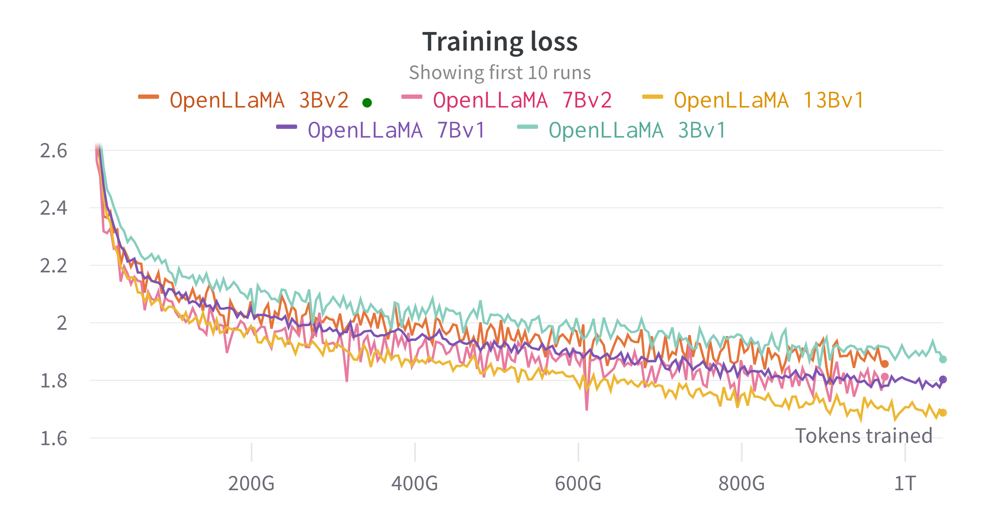

# OpenLLaMA: An Open Reproduction of LLaMA

**TL;DR**: we are releasing our public preview of OpenLLaMA, a permissively licensed open source reproduction of Meta AI’s LLaMA. We are releasing a series of 3B, 7B and 13B models trained on different data mixtures. Our model weights can serve as the drop in replacement of LLaMA in existing implementations.

In this repo, we present a permissively licensed open source reproduction of Meta AI's [LLaMA](https://ai.facebook.com/blog/large-language-model-llama-meta-ai/) large language model. We are releasing a series of 3B, 7B and 13B models trained on 1T tokens. We provide PyTorch and JAX weights of pre-trained OpenLLaMA models, as well as evaluation results and comparison against the original LLaMA models. The v2 model is better than the old v1 model trained on a different data mixture.

#### PyTorch weights for Hugging Face transformers:
- **v2 Models**
    - [OpenLLaMA 3Bv2](https://huggingface.co/openlm-research/open_llama_3b_v2)
    - [OpenLLaMA 7Bv2](https://huggingface.co/openlm-research/open_llama_7b_v2)
- **v1 Models**
    - [OpenLLaMA 3B](https://huggingface.co/openlm-research/open_llama_3b)
    - [OpenLLaMA 7B](https://huggingface.co/openlm-research/open_llama_7b)
    - [OpenLLaMA 13B](https://huggingface.co/openlm-research/open_llama_13b)

#### JAX weights for [EasyLM](https://github.com/young-geng/EasyLM):
- **v2 Models**
    - [OpenLLaMA 3Bv2 for EasyLM](https://huggingface.co/openlm-research/open_llama_3b_v2_easylm)
    - [OpenLLaMA 7Bv2 for EasyLM](https://huggingface.co/openlm-research/open_llama_7b_v2_easylm)
- **v1 Models**
    - [OpenLLaMA 3B for EasyLM](https://huggingface.co/openlm-research/open_llama_3b_easylm)
    - [OpenLLaMA 7B for EasyLM](https://huggingface.co/openlm-research/open_llama_7b_easylm)
    - [OpenLLaMA 13B for EasyLM](https://huggingface.co/openlm-research/open_llama_13b_easylm)
[](https://huggingface.co/openlm-research/open_llama_3b_600bt_preview_easylm)


## Updates

#### 07/15/2023
We are releasing the OpenLLaMA 3Bv2 model, which is a 3B model trained for 1T tokens on the same dataset mixture as the 7Bv2 model.

#### 07/07/2023
We are happy to release an OpenLLaMA 7Bv2 model, which is trained on a mixture of [Falcon refined-web dataset](https://huggingface.co/datasets/tiiuae/falcon-refinedweb), mixed with the [starcoder dataset](https://huggingface.co/datasets/bigcode/starcoderdata), and the wikipedia, arxiv and books and stackexchange from [RedPajama](https://huggingface.co/datasets/togethercomputer/RedPajama-Data-1T).

#### 06/15/2023
We are happy to release our final 1T token version of OpenLLaMA 13B. We’ve updated the evaluation results. For current version of OpenLLaMA models, our tokenizer is trained to merge multiple empty spaces into one before tokenization, similar to T5 tokenizer. Because of this, our tokenizer will not work with code generation tasks (e.g. HumanEval) since code involves many empty spaces.  For code related tasks, please use the v2 models.

#### 06/07/2023
We are happy to release our final 1T token version of OpenLLaMA 3B and 7B. We’ve updated the evaluation results. We are also happy to release a 600B token preview of the 13B model, trained in collaboration with [Stability AI](https://stability.ai/).

#### 05/22/2023
We are happy to release our 700B token checkpoint for the OpenLLaMA 7B model and 600B token checkpoint for the 3B model. We’ve also updated the evaluation results. We expect the full 1T token training run to finish at the end of this week.

#### 05/15/2023
After receiving feedback from the community, we discovered that the tokenizer of our previous checkpoint release was configured incorrectly so that new lines are not preserved. To fix this problem, we have retrained our tokenizer and restarted the model training. We’ve also observed lower training loss with this new tokenizer.


## Weights Release, License and Usage

We release the weights in two formats: an EasyLM format to be use with our [EasyLM framework](https://github.com/young-geng/EasyLM), and a PyTorch format to be used with the [Hugging Face transformers](https://huggingface.co/docs/transformers/index) library. Both our training framework EasyLM and the checkpoint weights are licensed permissively under the Apache 2.0 license.

### Loading the Weights with Hugging Face Transformers
Preview checkpoints can be directly loaded from Hugging Face Hub. **Please note that it is advised to avoid using the Hugging Face fast tokenizer for now, as we’ve observed that** [**the auto-converted fast tokenizer sometimes gives incorrect tokenizations**](https://github.com/huggingface/transformers/issues/24233)**.** This can be achieved by directly using the `LlamaTokenizer` class, or passing in the `use_fast=False` option for the `AutoTokenizer` class. See the following example for usage.

```python
import torch
from transformers import LlamaTokenizer, LlamaForCausalLM

## v2 models
model_path = 'openlm-research/open_llama_3b_v2'
# model_path = 'openlm-research/open_llama_7b_v2'

## v1 models
# model_path = 'openlm-research/open_llama_3b'
# model_path = 'openlm-research/open_llama_7b'
# model_path = 'openlm-research/open_llama_13b'

tokenizer = LlamaTokenizer.from_pretrained(model_path)
model = LlamaForCausalLM.from_pretrained(
    model_path, torch_dtype=torch.float16, device_map='auto',
)

prompt = 'Q: What is the largest animal?\nA:'
input_ids = tokenizer(prompt, return_tensors="pt").input_ids

generation_output = model.generate(
    input_ids=input_ids, max_new_tokens=32
)
print(tokenizer.decode(generation_output[0]))
```

For more advanced usage, please follow the [transformers LLaMA documentation](https://huggingface.co/docs/transformers/main/model_doc/llama).

### Evaluating with LM-Eval-Harness
The model can be evaluated with [lm-eval-harness](https://github.com/EleutherAI/lm-evaluation-harness). However, due to the aforementioned tokenizer issue, we need to avoid using the fast tokenizer to obtain the correct results. This can be achieved by passing in `use_fast=False` to [this part of lm-eval-harness](https://github.com/EleutherAI/lm-evaluation-harness/blob/4b701e228768052cfae9043dca13e82052ca5eea/lm_eval/models/huggingface.py#LL313C9-L316C10), as shown in the example below:

```python
tokenizer = self.AUTO_TOKENIZER_CLASS.from_pretrained(
    pretrained if tokenizer is None else tokenizer,
    revision=revision + ("/" + subfolder if subfolder is not None else ""),
    use_fast=False
)
```

### Loading the Weights with EasyLM
For using the weights in our EasyLM framework, please refer to the [LLaMA documentation of EasyLM](https://github.com/young-geng/EasyLM/blob/main/docs/llama.md). Note that unlike the original LLaMA model, our OpenLLaMA tokenizer and weights are trained completely from scratch so it is no longer needed to obtain the original LLaMA tokenizer and weights.


## Dataset and Training

The v1 models are trained on the [RedPajama dataset](https://huggingface.co/datasets/togethercomputer/RedPajama-Data-1T). The v2 models are trained on a mixture of the [Falcon refined-web dataset](https://huggingface.co/datasets/tiiuae/falcon-refinedweb), the [StarCoder dataset](https://huggingface.co/datasets/bigcode/starcoderdata) and the wikipedia, arxiv, book and stackexchange part of the [RedPajama dataset](https://huggingface.co/datasets/togethercomputer/RedPajama-Data-1T).  We follow the exactly same preprocessing steps and training hyperparameters as the original LLaMA paper, including model architecture, context length, training steps, learning rate schedule, and optimizer.  The only difference between our setting and the original one is the dataset used: OpenLLaMA employs open datasets rather than the one utilized by the original LLaMA.

We train the models on cloud TPU-v4s using [EasyLM](https://github.com/young-geng/EasyLM), a JAX based training pipeline we developed for training and fine-tuning large language models. We employ a combination of normal data parallelism and fully sharded data parallelism [](https://engineering.fb.com/2021/07/15/open-source/fsdp/)(also know as ZeRO stage 3) to balance the training throughput and memory usage. Overall we reach a throughput of over 2200 tokens / second / TPU-v4 chip for our 7B model. The training loss can be seen in the figure below.



## Evaluation

We evaluated OpenLLaMA on a wide range of tasks using [lm-evaluation-harness](https://github.com/EleutherAI/lm-evaluation-harness).  The LLaMA results are generated by running the original LLaMA model on the same evaluation metrics. We note that our results for the LLaMA model differ slightly from the original LLaMA paper, which we believe is a result of different evaluation protocols. Similar differences have been reported in [this issue of lm-evaluation-harness](https://github.com/EleutherAI/lm-evaluation-harness/issues/443). Additionally, we present the results of GPT-J, a 6B parameter model trained on the [Pile](https://pile.eleuther.ai/) dataset by [EleutherAI](https://www.eleuther.ai/).

The original LLaMA model was trained for 1 trillion tokens and GPT-J was trained for 500 billion tokens.  We present the results in the table below. OpenLLaMA exhibits comparable performance to the original LLaMA and GPT-J across a majority of tasks, and outperforms them in some tasks.


| **Task/Metric**        | GPT-J 6B | LLaMA 7B | LLaMA 13B | OpenLLaMA 3Bv2 | OpenLLaMA 7Bv2 | OpenLLaMA 3B | OpenLLaMA 7B | OpenLLaMA 13B |
| ---------------------- | -------- | -------- | --------- | -------------- | -------------- | ------------ | ------------ | ------------- |
| anli_r1/acc            | 0.32     | 0.35     | 0.35      | 0.33           | 0.34           | 0.33         | 0.33         | 0.33          |
| anli_r2/acc            | 0.34     | 0.34     | 0.36      | 0.36           | 0.35           | 0.32         | 0.36         | 0.33          |
| anli_r3/acc            | 0.35     | 0.37     | 0.39      | 0.38           | 0.39           | 0.35         | 0.38         | 0.40          |
| arc_challenge/acc      | 0.34     | 0.39     | 0.44      | 0.34           | 0.39           | 0.34         | 0.37         | 0.41          |
| arc_challenge/acc_norm | 0.37     | 0.41     | 0.44      | 0.36           | 0.41           | 0.37         | 0.38         | 0.44          |
| arc_easy/acc           | 0.67     | 0.68     | 0.75      | 0.68           | 0.73           | 0.69         | 0.72         | 0.75          |
| arc_easy/acc_norm      | 0.62     | 0.52     | 0.59      | 0.63           | 0.70           | 0.65         | 0.68         | 0.70          |
| boolq/acc              | 0.66     | 0.75     | 0.71      | 0.66           | 0.72           | 0.68         | 0.71         | 0.75          |
| hellaswag/acc          | 0.50     | 0.56     | 0.59      | 0.52           | 0.56           | 0.49         | 0.53         | 0.56          |
| hellaswag/acc_norm     | 0.66     | 0.73     | 0.76      | 0.70           | 0.75           | 0.67         | 0.72         | 0.76          |
| openbookqa/acc         | 0.29     | 0.29     | 0.31      | 0.26           | 0.30           | 0.27         | 0.30         | 0.31          |
| openbookqa/acc_norm    | 0.38     | 0.41     | 0.42      | 0.38           | 0.41           | 0.40         | 0.40         | 0.43          |
| piqa/acc               | 0.75     | 0.78     | 0.79      | 0.77           | 0.79           | 0.75         | 0.76         | 0.77          |
| piqa/acc_norm          | 0.76     | 0.78     | 0.79      | 0.78           | 0.80           | 0.76         | 0.77         | 0.79          |
| record/em              | 0.88     | 0.91     | 0.92      | 0.87           | 0.89           | 0.88         | 0.89         | 0.91          |
| record/f1              | 0.89     | 0.91     | 0.92      | 0.88           | 0.89           | 0.89         | 0.90         | 0.91          |
| rte/acc                | 0.54     | 0.56     | 0.69      | 0.55           | 0.57           | 0.58         | 0.60         | 0.64          |
| truthfulqa_mc/mc1      | 0.20     | 0.21     | 0.25      | 0.22           | 0.23           | 0.22         | 0.23         | 0.25          |
| truthfulqa_mc/mc2      | 0.36     | 0.34     | 0.40      | 0.35           | 0.35           | 0.35         | 0.35         | 0.38          |
| wic/acc                | 0.50     | 0.50     | 0.50      | 0.50           | 0.50           | 0.48         | 0.51         | 0.47          |
| winogrande/acc         | 0.64     | 0.68     | 0.70      | 0.63           | 0.66           | 0.62         | 0.67         | 0.70          |
| Average                | 0.52     | 0.55     | 0.57      | 0.53           | 0.56           | 0.53         | 0.55         | 0.57          |


We removed the task CB and WSC from our benchmark, as our model performs suspiciously high on these two tasks. We hypothesize that there could be a benchmark data contamination in the training set.


## Contact

We would love to get feedback from the community. If you have any questions, please open an issue or contact us.

OpenLLaMA is developed by:
[Xinyang Geng](https://young-geng.xyz/)* and [Hao Liu](https://www.haoliu.site/)* from Berkeley AI Research.
*Equal Contribution


## Acknowledgment

We thank the [Google TPU Research Cloud](https://sites.research.google/trc/about/) program for providing part of the computation resources. We’d like to specially thank Jonathan Caton from TPU Research Cloud for helping us organizing compute resources, Rafi Witten from the Google Cloud team and James Bradbury from the Google JAX team for helping us optimizing our training throughput. We’d also want to thank Charlie Snell, Gautier Izacard, Eric Wallace, Lianmin Zheng and our user community for the discussions and feedback.

The OpenLLaMA 13B v1 model is trained in collaboration with [Stability AI](https://stability.ai/), and we thank Stability AI for providing the computation resources. We’d like to especially thank David Ha and Shivanshu Purohit for the coordinating the logistics and providing engineering support.


## Reference

If you found OpenLLaMA useful in your research or applications, please cite using the following BibTeX:
```
@software{openlm2023openllama,
  author = {Geng, Xinyang and Liu, Hao},
  title = {OpenLLaMA: An Open Reproduction of LLaMA},
  month = May,
  year = 2023,
  url = {https://github.com/openlm-research/open_llama}
}
```
```
@software{together2023redpajama,
  author = {Together Computer},
  title = {RedPajama-Data: An Open Source Recipe to Reproduce LLaMA training dataset},
  month = April,
  year = 2023,
  url = {https://github.com/togethercomputer/RedPajama-Data}
}
```
```
@article{touvron2023llama,
  title={Llama: Open and efficient foundation language models},
  author={Touvron, Hugo and Lavril, Thibaut and Izacard, Gautier and Martinet, Xavier and Lachaux, Marie-Anne and Lacroix, Timoth{\'e}e and Rozi{\`e}re, Baptiste and Goyal, Naman and Hambro, Eric and Azhar, Faisal and others},
  journal={arXiv preprint arXiv:2302.13971},
  year={2023}
}
```


