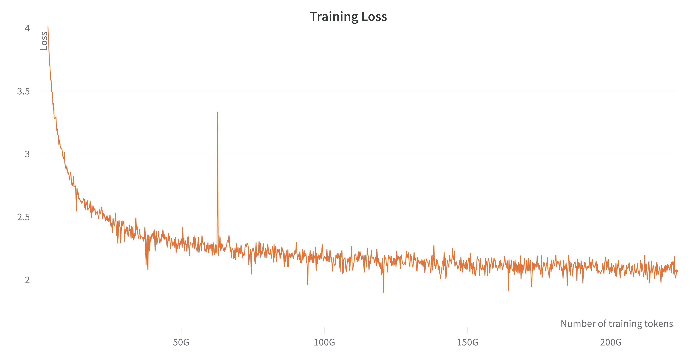

# OpenLLaMA: An Open Reproduction of LLaMA

In this repo, we release a permissively licensed open source reproduction of Meta AI's [LLaMA](https://ai.facebook.com/blog/large-language-model-llama-meta-ai/) large language model. In this release, we're releasing a public preview of the 7B OpenLLaMA model that has been trained with 200 billion tokens. We provide PyTorch and Jax weights of pre-trained OpenLLaMA models, as well as evaluation results and comparison against the original LLaMA models. Stay tuned for our updates.

**JAX and PyTorch Weights on Huggingface Hub**
- [200B Tokens Checkpoint](https://huggingface.co/openlm-research/open_llama_7b_preview_200bt)
- [300B Tokens Checkpoint](https://huggingface.co/openlm-research/open_llama_7b_preview_300bt)


## Update 5/3/2023
We have released a new checkpoint of OpenLLaMA 7B trained on 300B tokens. In communicating
with our users, we have realized that many existing implementations of LLaMA does not
prepend the BOS token (id=1) at generation time. Our 200B checkpoint is sensitive
to this and may produce degraded results without BOS token at the beginning. Hence,
we recommend always prepending the BOS token when using our 200B checkpoint.

In an effort to make our model broadly compatible with existing implementations, we have now
released a new 300B checkpoint, which is less sensitive to BOS token and can be used
either way.


## Dataset and Training

We train our models on the [RedPajama](https://www.together.xyz/blog/redpajama) dataset released by [Together](https://www.together.xyz/), which is a reproduction of the LLaMA training dataset containing over 1.2 trillion tokens. We follow the exactly same preprocessing steps and training hyperparameters as the original LLaMA paper, including model architecture, context length, training steps, learning rate schedule, and optimizer.  The only difference between our setting and the original one is the dataset used: OpenLLaMA employs the RedPajama dataset rather than the one utilized by the original LLaMA.

We train the models on cloud TPU-v4s using [EasyLM](https://github.com/young-geng/EasyLM), a JAX based training pipeline we developed for training and fine-tuning language model. We employ a combination of normal data parallelism and [fully sharded data parallelism (also know as ZeRO stage 3)](https://engineering.fb.com/2021/07/15/open-source/fsdp/) to balance the training throughput and memory usage. Overall we reach a throughput of over 1900 tokens / second / TPU-v4 chip in our training run. The training loss can be seen in the figure below.




## Evaluation

We evaluated OpenLLaMA on a wide range of tasks using [lm-evaluation-harness](https://github.com/EleutherAI/lm-evaluation-harness).  The LLaMA results are generated by running the original LLaMA model on the same evaluation metrics. We note that our results for the LLaMA model differ slightly from the original LLaMA paper, which we believe is a result of different evaluation protocols. Similar differences have been reported in [this issue of lm-evaluation-harness](https://github.com/EleutherAI/lm-evaluation-harness/issues/443). Additionally, we present the results of GPT-J, a 6B parameter model trained on the [Pile](https://pile.eleuther.ai/) dataset by [EleutherAI](https://www.eleuther.ai/).

The original LLaMA model was trained for 1 trillion tokens and GPT-J was trained for 500 billion tokens, whereas OpenLLaMA was trained on 200 billion tokens.  We present the results in the table below. OpenLLaMA exhibits comparable performance to the original LLaMA and GPT-J across a majority of tasks, and outperforms them in some tasks. We expect that the performance of OpenLLaMA, after completing its training on 1 trillion tokens, will be enhanced even further.


| **Task/Metric**        | **GPT-J 6B** | **LLaMA 7B** | **Open LLaMA 7B Preview 200B Tokens** |
| ---------------------- | ------------ | ------------ | ------------------------------------- |
| anli_r1/acc            | 0.32         | 0.35         | 0.34                                  |
| anli_r2/acc            | 0.34         | 0.34         | 0.35                                  |
| anli_r3/acc            | 0.35         | 0.37         | 0.34                                  |
| arc_challenge/acc      | 0.34         | 0.39         | 0.31                                  |
| arc_challenge/acc_norm | 0.37         | 0.41         | 0.34                                  |
| arc_easy/acc           | 0.67         | 0.68         | 0.66                                  |
| arc_easy/acc_norm      | 0.62         | 0.52         | 0.59                                  |
| boolq/acc              | 0.66         | 0.75         | 0.67                                  |
| cb/acc                 | 0.36         | 0.36         | 0.38                                  |
| cb/f1                  | 0.26         | 0.24         | 0.29                                  |
| hellaswag/acc          | 0.50         | 0.56         | 0.47                                  |
| hellaswag/acc_norm     | 0.66         | 0.73         | 0.63                                  |
| openbookqa/acc         | 0.29         | 0.29         | 0.26                                  |
| openbookqa/acc_norm    | 0.38         | 0.41         | 0.37                                  |
| piqa/acc               | 0.75         | 0.78         | 0.74                                  |
| piqa/acc_norm          | 0.76         | 0.78         | 0.74                                  |
| record/em              | 0.88         | 0.91         | 0.87                                  |
| record/f1              | 0.89         | 0.91         | 0.88                                  |
| rte/acc                | 0.54         | 0.56         | 0.53                                  |
| truthfulqa_mc/mc1      | 0.20         | 0.21         | 0.21                                  |
| truthfulqa_mc/mc2      | 0.36         | 0.34         | 0.34                                  |
| wic/acc                | 0.50         | 0.50         | 0.50                                  |
| winogrande/acc         | 0.64         | 0.68         | 0.62                                  |
| wsc/acc                | 0.37         | 0.35         | 0.57                                  |
| Average                | 0.50         | 0.52         | 0.50                                  |


## Preview Weights Release and Usage

To encourage the feedback from the community, we release a preview checkpoint of our weights. The checkpoint can be downloaded from [HuggingFace Hub](https://huggingface.co/openlm-research/open_llama_7b_preview_200bt). We release the weights in two formats: an EasyLM format to be use with our [EasyLM framework](https://github.com/young-geng/EasyLM), and a PyTorch format to be used with the [Huggingface Transformers](https://huggingface.co/docs/transformers/index) library.

For using the weights in our EasyLM framework, please refer to the [LLaMA documentation of EasyLM](https://github.com/young-geng/EasyLM/blob/main/docs/llama.md). Note that unlike the original LLaMA model, our OpenLLaMA tokenizer and weights are trained completely from scratch so it is no longer needed to obtain the original LLaMA tokenizer and weights. For using the weights in the transformers library, please follow the [transformers LLaMA documentation](https://huggingface.co/docs/transformers/main/model_doc/llama). Note that we use BOS (beginning of sentence) token (id=1) during training, so it is important to prepend this token for best performance during few-shot evaluation.

Both our training framework EasyLM and the preview checkpoint weights are licensed permissively under the Apache 2.0 license.


## Future Plans

The current release is only a preview of what the complete OpenLLaMA release will offer. We are currently focused on completing the training process on the entire RedPajama dataset. This can gives us a good apple-to-apple comparison between the original LLaMA and our OpenLLaMA. Other than the 7B model, we are also training a smaller 3B model in hope of facilitating language model usage in low resource use cases.  Please stay tuned for our upcoming releases.


## Contact

We would love to get feedback from the community. If you have any questions, please open an issue or contact us.

OpenLLaMA is developed by:
[Xinyang Geng](https://young-geng.xyz/)* and [Hao Liu](https://www.haoliu.site/)* from Berkeley AI Research.
*Equal Contribution


## Resources

- [How to run OpenLLaMa on Google Colab with Hugging Face Transformers (YouTube Video)](https://www.youtube.com/watch?v=1NOPciKuQb8)
- [Hacker News Discussion of OpenLLaMa](https://news.ycombinator.com/item?id=35798888)


## Reference

If you found OpenLLaMA useful in your research or applications, please cite using the following BibTeX:
```
@software{openlm2023openllama,
  author = {Geng, Xinyang and Liu, Hao},
  title = {OpenLLaMA: An Open Reproduction of LLaMA},
  month = May,
  year = 2023,
  url = {https://github.com/openlm-research/open_llama}
}
```
```
@software{together2023redpajama,
  author = {Together Computer},
  title = {RedPajama-Data: An Open Source Recipe to Reproduce LLaMA training dataset},
  month = April,
  year = 2023,
  url = {https://github.com/togethercomputer/RedPajama-Data}
}
```
```
@article{touvron2023llama,
  title={Llama: Open and efficient foundation language models},
  author={Touvron, Hugo and Lavril, Thibaut and Izacard, Gautier and Martinet, Xavier and Lachaux, Marie-Anne and Lacroix, Timoth{\'e}e and Rozi{\`e}re, Baptiste and Goyal, Naman and Hambro, Eric and Azhar, Faisal and others},
  journal={arXiv preprint arXiv:2302.13971},
  year={2023}
}
```
